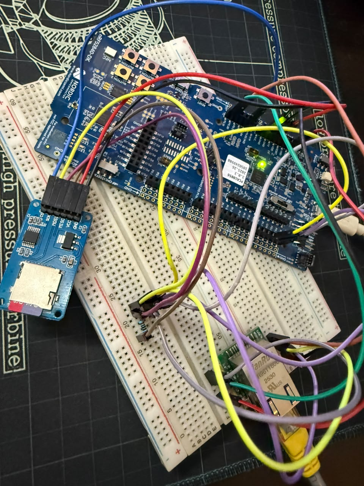
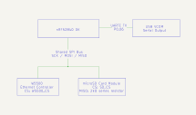
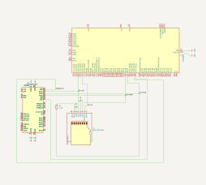

# nRF52840 web server

https://loke.sh/blog/nrf52840-web-server

> [!IMPORTANT]
> The technical write-up series is still ongoing and currently incomplete.
> Subscribe to my [Newsletter](https://loke.sh/blog/newsletter/) for updates.

A small web server built on the [nRF52840](https://www.nordicsemi.com/Products/nRF52840) using [FreeRTOS](https://github.com/FreeRTOS/FreeRTOS-Kernel), W5500 Ethernet, and a microSD card.

### Features

- W5500 Ethernet
- microSD storage
- Shared SPI bus
- FAT filesystem support
- Static HTTP file serving
- UARTE-based serial logging

### Hardware

- [nRF52840 DK](https://www.nordicsemi.com/Products/Development-hardware/nRF52840-DK)
- [W5500 Ethernet module](https://wiznet.io/products/ethernet-chips/w5500)
- [microSD card](https://en.wikipedia.org/wiki/SD_card)
- 2 kΩ series resistor on SD MISO

> Note: The 2 kΩ series resistor on SD MISO is a temporary workaround for [bus contention](https://forum.arduino.cc/t/spi-sd-card-reader-other-spi-device-not-working-together/447006)
> caused by the SD module's always-enabled output buffer. Some SD card reader modules, including mine, have this issue. If your
> module works reliably on a shared SPI bus without the resistor, you can omit it. A proper hardware fix will be covered in an
> upcoming [write-up](https://loke.sh/blog/nrf52840-web-server).

### Physical Setup



### Demo

https://loke.sh/blog/nrf52840-web-server/demo.webm

HTTP [stress-test](./docs/demo/http_stress_test.sh) results: [http_stress_test.log](./docs/demo/http_stress_test.log)

### Build and flash

```shell
git clone --recurse-submodules https://github.com/codetit4n/nrf52840-webserver
cd nrf52840-webserver

make
make flash
```

Or flash directly with `nrfjprog`:

```shell
nrfjprog --program build/webserver.elf --chiperase --verify --reset
```

Serial output:

```shell
minicom -D /dev/ttyACM0 -b 1000000
```

### Usage

Place files to be served inside the `static` directory at the root of the SD card:

```text
/
└── static/
    ├── INDEX.HTML
    ├── STYLE.CSS
    └── APP.JS
```

The `static` directory acts as the HTTP web root. Files can be served directly.

The network configuration is currently static and defined in [`net.h`](./include/modules/net.h#L4-L8):

```c
#define NET_MAC     {0x02, 0x00, 0x00, 0x00, 0x00, 0x50}
#define NET_IP      {192, 168, 29, 70}
#define NET_SUBNET  {255, 255, 255, 0}
#define NET_GATEWAY {192, 168, 29, 1}
#define NET_DNS     {192, 168, 29, 1}
```

Update these values to match your local network before flashing.

With the default configuration, the server is available at:

```text
http://192.168.29.70:8080
```

### Limitations

- SDHC/SDXC only
- Static IP configuration
- No HTTPS

### Block diagram



### Wiring diagram



### Progress

See [PROGRESS.md](PROGRESS.md) for the implementation checklist.

### Documentation

Detailed implementation notes, design decisions, and debugging write-ups are covered in the ongoing project series:
https://loke.sh/blog/nrf52840-web-server
